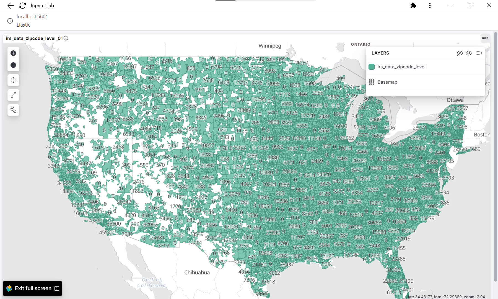

# EH-Analytics

## Introduction
This repository contains the code and documentation for the EH Geographic Data Project. The objective of this project was to obtain statistical data from the American Internal Revenue Service (IRS) and perform data merging and enrichment by adding geolocation information. The purpose was to create a dashboard and provide various statistical data to users.

## Screenshots
Here is a screenshot of the project's dashboard:
data example with the total medical and dental expense deduction amount by zipcode:

## Data Sources: 

> ##### IRS - SOI Tax Stats - Individual Income Tax Statistics - 2020 ZIP Code Data (SOI)
> ##### Site: https://www.irs.gov/statistics/soi-tax-stats-individual-income-tax-statistics-2020-zip-code-data-soi
> ##### Download Link: https://www.irs.gov/pub/irs-soi/20zpallnoagi.csv
---
> ##### Elastic Maps Service (EMS): Selected  Vector Layer:  USA Zip Codes 
> ##### Site: https://maps.elastic.co/#file/usa_zip_codes
> ##### Download link: https://vector.maps.elastic.co/files/usa_zip_codes_v7.geo.json?elastic_tile_service_tos=agree&my_app_name=ems-landing-page&my_app_version=8.7.0&license=643c1faf-80fc-4ab0-9323-4d9bd11f4bbc

## Project Structure
The project has the following folder structure:

- `data_processing`: Contains the code for data processing and manipulation.
  - `_sandbox`: Folder for experimenting with different scripts.
  - `config`: Configuration files for the project.
  - `helpers`: Helper modules and utilities.
  - `proc_input`: Code for processing input data.
  - `proc_output`: Code for generating output data.
  - `src_input`: Input data files for the project.
  - `src_output`: Output data generated by the project.

- `iac`: Infrastructure as Code (IaC) related files.
  - `clickhouse`: ClickHouse database related files.
  - `elasticsearch`: Elasticsearch related files.

- `img`: Folder to store project images and screenshots.

- `LICENSE`: License file for the project.

- `README.md`: This documentation file.

- `dashboard_example.pdf`: An example PDF document showcasing the project's dashboard.

## Coding Structure and Technologies Used
For the coding structure, Elasticsearch, and Kibana were utilized. Additionally, the analytical database chosen for this project was ClickHouse. Python libraries such as pandas and the ClickHouse driver were used to handle data ingestion, treatment, and insertion into ClickHouse.

## Challenges Faced
During the project, the following challenges were encountered:

- Setting up the infrastructure as code, including necessary adjustments in the Linux environment to run Elasticsearch and the server.
- Defining a network using Docker to facilitate communication between Kibana and Elasticsearch services.
- Implementing data persistence in ClickHouse due to the need for persistent data storage while running services through Docker containers.
- Working with libraries like pandas to process semi-structured data and GeoJSON files.

## Next Steps
Based on the project's current state, the suggested next steps for further development are as follows:

- Build a comprehensive data model using the existing structure to ingest data from additional sources. This will allow for a more robust and scalable solution.
- Enhance understanding of Kibana's dashboard building capabilities, including exploring geospatial visualizations, choropleth maps, bubble maps, and other relevant visualizations. This will enable the effective presentation of geospatial data and provide valuable insights to users.
- Gain a deeper understanding of data ingestion in Elasticsearch, exploring methods beyond manual ingestion through Kibana's graphical interface.
- Write unit tests and data quality tests to ensure the reliability and accuracy of the code and data.
- Implement task orchestration to automate data processing steps and ensure efficient workflows.
- Continuously optimize the infrastructure and data processing pipeline to improve performance and scalability.
Please note that these suggestions are meant to guide you, and you can customize the next steps according to your project's specific requirements and objectives.

## License
The project is available under the Apache License 2.0, which is an open-source license. You can find the full text of the license in the [LICENSE](https://github.com/danielvds01x/eh-analytics/blob/main/LICENSE) file.
